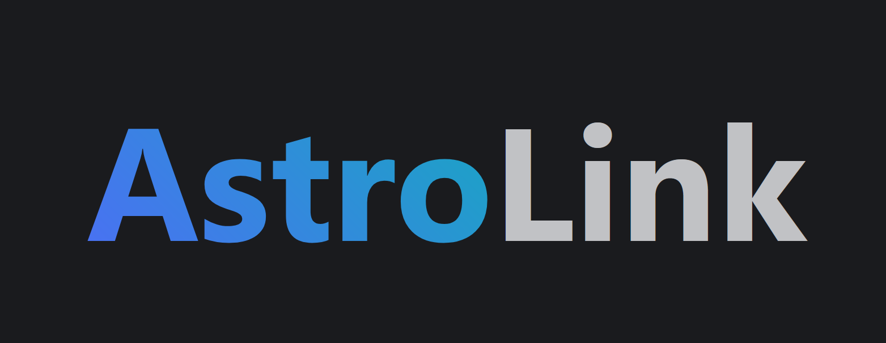

<br />
<div align="center">
  <a href="https://github.com/false-positive/notewell">
    
  </a>

  <h3 align="center">Hack TUES Infinity</h3>

  <p align="center">
    <em>AstroLink</em> e платформа за споделяне на файлове с данни за астрономически проучвания. Основната идея на проекта е да следи развитието на дадено проучване, да систематизира данните в него и да ги прави достъпни за всеки участник в проекта, независимо дали той се намира на Земята или в космоса. Хората работещи по дадедено проучване са обединени в екипи като всеки user може да е член на повече от един екип и проект, както и всеки екип може да се занимава с няколко проекта едновременно.
    <br />
    <a href="https://hacktues.com/team?teamId=6201620d1d06c5ac94f4c789&myTeam=true">Нашия отбор »</a>
    <br />
    <br />
    <a href="./LICENSE">License</a>
    ·
    <a href="https://github.com/false-positive/notewell/issues">Report Bug</a>
    ·
    <a href="https://github.com/false-positive/notewell/issues">Request Feature</a>
  </p>
</div>

## Built With
- [Django](https://djangoproject.com/)
- [Django REST framework](https://www.django-rest-framework.org/)
- [Python](https://www.python.org/)
- [Next.JS](https://nextjs.org/)
- [React.JS](https://reactjs.org/)

## Getting Started

### Prerequisites

- [Python](https://python.org) 3.9 (or higher)
- Pipenv

  ``` shell
  $ python -m pip install -U pipenv
  ```
  
### Installation
1. Clone the AstroLink repo

  In this documentation, we will clone the repo in the home directory of the user, however it is recommended that you put it in a better location. Just keep in mind that you will have to change it in the `cd` commands later on 🙂
  
  ``` shell
  $ git clone https://github.com/false-positive/astrolink ~/astrolink
  ```

2. Setup the Django development database

  ``` shell
  $ mkdir -p ~/Projects/astrolink/server
  $ cd ~/Projects/astrolink/server/
  $ pipenv --python 3.9 install django
  $ pipenv run django-admin startproject astrolink 
  ```

3. Setup the Next.js development database
  
  ``` shell
  $ cd ~/Projects/server/web/
  $ npm i
  $ npm run dev
  ```

4. Run the Django development server
 
  ``` shell
  $ cd ~/notewell/website/
  $ python manage.py runserver
  ```
  > Note: It should be runned simultaneously with the Next.js development database
  
5. Head on over to <http://localhost:3000/register/> and create your user.

## License

This program is free software: you can redistribute it and/or modify
it under the terms of the GNU Affero General Public License as published by
the Free Software Foundation, either version 3 of the License, or
(at your option) any later version.

See [LICENSE](./LICENSE) for more details.
